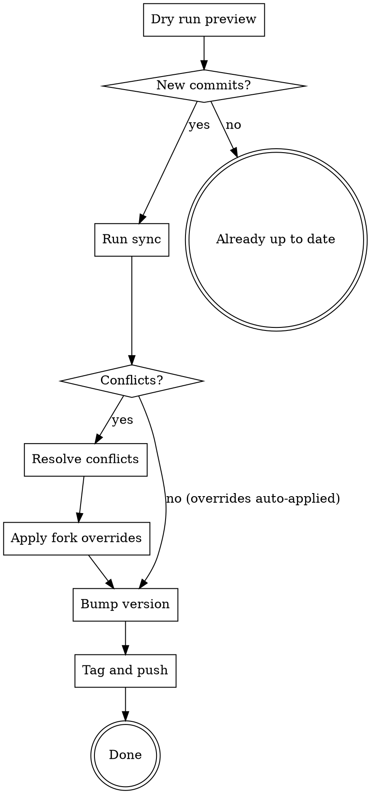

# Sync Upstream and Version Bump

Merge latest upstream changes into this fork and roll the version number. Uses automated scripts to handle manifest overrides.

## Prerequisites

- Clean working tree (no uncommitted changes)
- On `main` branch
- `jq` installed

## Workflow



## Steps

### 1. Preview upstream changes

```bash
scripts/sync-upstream.sh --dry-run
```

Shows: new commit count, version delta, files with potential conflicts. No changes made.

### 2. Run sync

```bash
scripts/sync-upstream.sh
```

This fetches upstream, merges `origin/main`, and auto-applies fork manifest overrides from `scripts/fork-config.json`.

### 3. If conflicts occur

The script stops and lists conflicting files. Resolve them:

- **Manifest files** (plugin.json, marketplace.json, etc.): Take upstream version, then run overrides script
- **Skill content files**: Read both sides, take upstream unless our change is intentional (e.g., opus-optimized trimming)
- **Additive files** (our Swift agents/skills): Should never conflict

```bash
# After resolving conflicts manually:
git add <resolved files>
git commit

# Re-apply fork overrides (use upstream version from dry-run output)
scripts/apply-fork-overrides.sh --version <upstream-version>
git add -u && git commit -m "apply fork overrides after upstream sync"
```

### 4. Bump version

Version format: `<upstream-version>.<patch>` — e.g., upstream `5.0.7` becomes `5.0.7.1` for our first patch.

```bash
scripts/apply-fork-overrides.sh --version <new-version>
git add .claude-plugin/plugin.json .claude-plugin/marketplace.json .cursor-plugin/plugin.json gemini-extension.json package.json
git commit -m "bump version to <new-version> in all plugin manifests"
```

### 5. Tag and push

```bash
git tag v<new-version>
git push internal main v<new-version>
```

## Fork Config

All fork-specific overrides live in `scripts/fork-config.json`:
- `plugin_overrides`: author, homepage, repository for plugin.json
- `marketplace_overrides`: owner, source URLs, extra plugins (e.g., swift-concurrency-pro)

To add a new fork-specific plugin, add it to `marketplace_overrides.extra_plugins` and re-run the overrides script.

## Quick Reference

| Task | Command |
|------|---------|
| Preview upstream | `scripts/sync-upstream.sh --dry-run` |
| Full sync | `scripts/sync-upstream.sh` |
| Bump version only | `scripts/apply-fork-overrides.sh --version X.Y.Z` |
| Re-apply overrides | `scripts/apply-fork-overrides.sh` |
| Tag + push | `git tag vX.Y.Z && git push internal main vX.Y.Z` |
